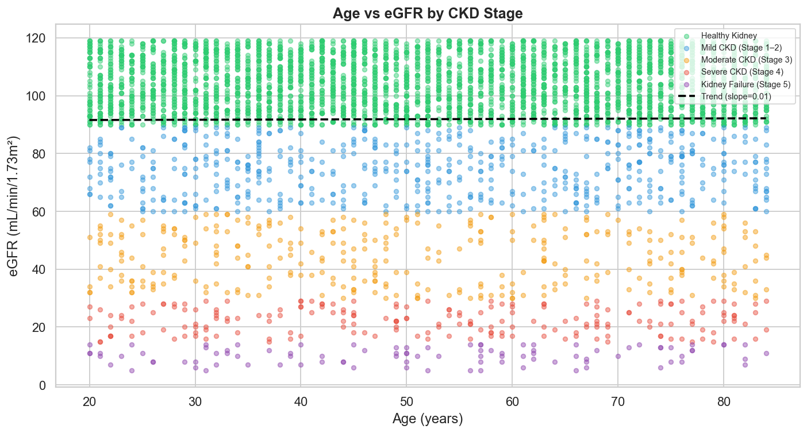
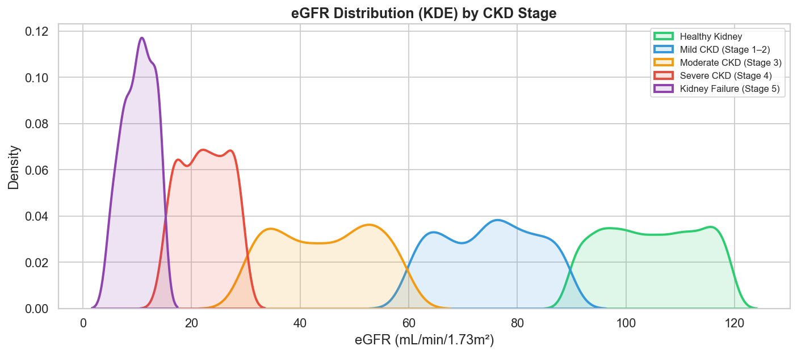
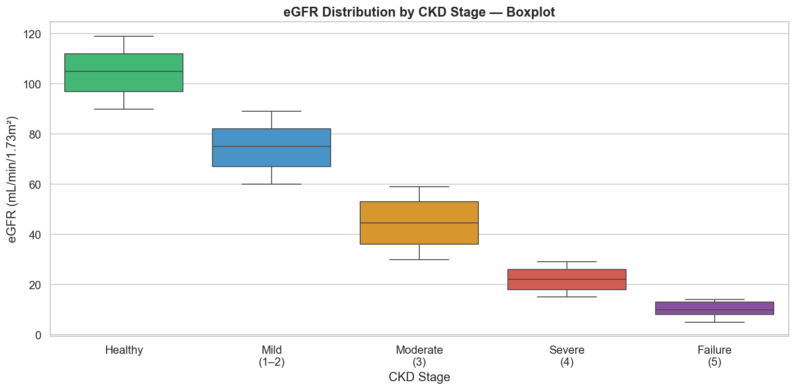
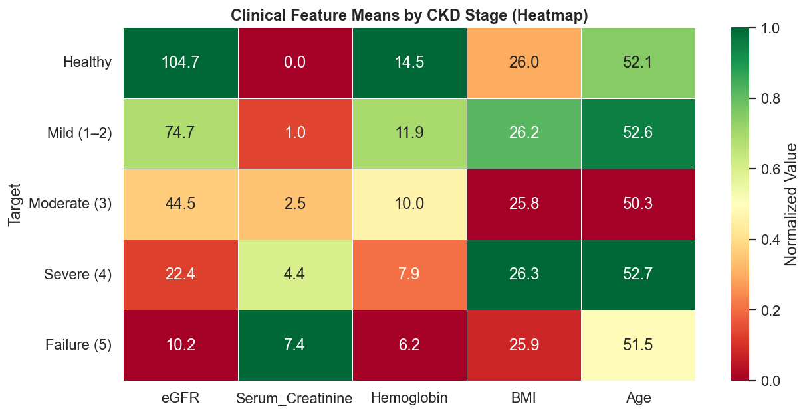

# 🩺 CKD Statistical Analysis
### Descriptive Statistics & Distribution Analysis on 4,800 Clinical Patient Records

<div align="center">


**Author:** Akmal Raxmatov &nbsp;|&nbsp; **Dataset:** 4,800 records · 36 features &nbsp;|&nbsp; **Status:** ✅ Complete

</div>

---

## 🎯 Project Overview

This project applies a **complete descriptive statistics pipeline** to clinical data on Chronic Kidney Disease (CKD) — a progressive condition affecting millions worldwide, classified into five stages based on kidney filtration rate (eGFR).

The core question driving this analysis: **can statistics alone reveal the story of disease progression?** From mean shifts to IQR separation to outlier density, the numbers confirm what clinicians observe — eGFR is the most statistically coherent marker of kidney decline.

> *"Statistics is the art of making numbers tell a story. In clinical data, that story has real consequences."*

---

## 📐 Statistical Concepts Covered

| Measure | Formula | Clinical Interpretation |
|:---|:---:|:---|
| **Mean** | $\bar{x} = \frac{\sum x_i}{n}$ | Average patient value per biomarker |
| **Median** | Middle value | Robust center — resistant to extreme lab readings |
| **Mode** | Most frequent value | Most common clinical reading in the population |
| **Variance** | $s^2 = \frac{\sum(x_i - \bar{x})^2}{n-1}$ | How widely patient readings deviate from average |
| **Std Deviation** | $s = \sqrt{s^2}$ | Spread in original clinical units |
| **IQR** | $Q_3 - Q_1$ | Middle 50% range — outlier-resistant spread |
| **Percentile** | $P_k$ | Value below which k% of patients fall |
| **Skewness** | $g_1 = \frac{\sum(x_i-\bar{x})^3}{(n-1)s^3}$ | Distribution symmetry across disease stages |
| **Kurtosis** | $g_2 = \frac{\sum(x_i-\bar{x})^4}{(n-1)s^4} - 3$ | Tail heaviness — outlier concentration |
| **Outlier Fence** | $Q_1 - 1.5 \cdot IQR \;\;;\;\; Q_3 + 1.5 \cdot IQR$ | Clinical extreme detection boundary |

---

## 🩻 Dataset

| Property | Value |
|:---|:---|
| Source | Chronic Kidney Disease Testing Dataset |
| Records | 4,800 patients |
| Features | 36 clinical columns |
| Target | 5 CKD severity stages |
| Missing Values | None |

**CKD Stages — ordered by severity:**

| Stage | Label | Mean eGFR | Sample Size |
|:---:|:---|:---:|:---:|
| 🟢 | Healthy Kidney | 104.7 | 3,615 |
| 🔵 | Mild CKD (Stage 1–2) | 74.7 | 575 |
| 🟡 | Moderate CKD (Stage 3) | 44.5 | 318 |
| 🔴 | Severe CKD (Stage 4) | 22.4 | 196 |
| 🟣 | Kidney Failure (Stage 5) | 10.2 | 96 |

---

## 📊 Results at a Glance

| Feature | Mean | Median | Std Dev | Variance | IQR | Skewness | Kurtosis |
|:---|---:|---:|---:|---:|---:|---:|---:|
| **Age** | 52.04 | 52.00 | 18.79 | 353.17 | 32.25 | 0.003 | −1.220 |
| **eGFR** | 91.89 | 100.00 | 26.66 | 710.61 | 20.00 | −1.579 | 1.732 |
| **BMI** | 26.00 | 26.00 | 4.95 | 24.48 | 8.00 | 0.000 | −1.224 |
| **Hemoglobin** | 13.45 | 14.00 | 2.30 | 5.31 | 2.00 | −1.288 | 1.553 |
| **Serum Creatinine** | 0.62 | 0.00 | 1.45 | 2.11 | 0.00 | 3.102 | 10.510 |

---

## 🔬 Analysis Walkthrough

### Step 1 — Load & Inspect

```python
import numpy as np
import pandas as pd

df = pd.read_csv("CKD_dataset.csv")
print(f"Shape: {df.shape}")         # (4800, 36)
print(df["Target"].value_counts())  # 5 stages
```

### Step 2 — NumPy Core Statistics

```python
egfr = np.array(df["eGFR"])

mean   = np.mean(egfr)     # 91.89
median = np.median(egfr)   # 100.00
std    = np.std(egfr)      # 26.66
var    = np.var(egfr)      # 710.61
```

### Step 3 — Percentile & IQR Outlier Detection

```python
q1  = np.percentile(egfr, 25)
q3  = np.percentile(egfr, 75)
iqr = q3 - q1                        # 20.00

lower_fence = q1 - 1.5 * iqr
upper_fence = q3 + 1.5 * iqr

n_outliers = np.sum((egfr < lower_fence) | (egfr > upper_fence))
# Result: 610 outliers (12.7%) — patients with extreme filtration readings
```

### Step 4 — Grouped Analysis (Pandas + NumPy)

```python
summary = df.groupby("Target")[["eGFR", "Serum_Creatinine", "Hemoglobin"]].agg(
    ["mean", "std", "median"]
).reindex(stage_order).round(2)
```

---

## 📈 Visualizations

The notebook generates **11 publication-quality charts** across all statistical topics:

| # | Chart | What It Shows |
|:---:|:---|:---|
| 01 | **Line Plot** | Age profile across 100 records with mean & median markers |
| 02 | **Bar Chart** | Mean vs Median comparison across 5 clinical features |
| 03 | **Scatter Plot** | Age vs eGFR colored by CKD stage + linear trend line |
| 04 | **Bar Chart** | Standard deviation per clinical feature |
| 05 | **Errorbar Line** | Mean ± Std Dev of eGFR across all 5 stages |
| 06 | **Histogram** | Age frequency distribution |
| 07 | **KDE Plot** | eGFR density curves by CKD stage — overlapping |
| 08 | **4-Panel Grid** | Histogram + KDE for Age, eGFR, Creatinine, BMI |
| 09 | **Boxplot** | Z-normalized features — outliers highlighted in red |
| 10 | **Boxplot** | eGFR IQR spread per CKD stage |
| 11 | **Heatmap** | Normalized clinical feature means across all 5 stages |

### Preview

| Scatter: Age vs eGFR by Stage | KDE: eGFR Density by Stage |
|:---:|:---:|
|  |  |

| Boxplot: eGFR per Stage | Heatmap: Feature × Stage |
|:---:|:---:|
|  |  |

---

## 💡 Key Findings

**1. eGFR is the clearest disease marker** — Mean eGFR drops monotonically from 104.7 (Healthy) to 10.2 (Kidney Failure), a 10× decline. The boxplots confirm minimal overlap between stages — eGFR is statistically sufficient to distinguish disease severity.

**2. eGFR is left-skewed (−1.579)** — The majority of patients are in the healthy range, pulling the distribution rightward. This reflects the dataset's class imbalance (3,615 healthy vs. 96 failure cases) and mirrors real-world CKD prevalence.

**3. Serum Creatinine is a high-noise indicator** — With skewness of 3.10 and kurtosis of 10.51, it is the most extreme distribution in the dataset. A small number of patients show drastically elevated creatinine — consistent with late-stage renal failure physiology.

**4. Age and BMI are platykurtic (kurtosis ≈ −1.22)** — Both distributions are flatter than normal. Patient ages spread uniformly from 20 to 84 with no sharp clustering — suggesting the dataset was designed to represent a full adult lifespan.

**5. Hemoglobin has 8.3% outliers** — Anemia is a known complication of advanced CKD. The outliers here are not noise — they are clinically meaningful low values concentrated in Stage 4–5 patients.

**6. Serum Creatinine has 24.7% outliers** — The highest outlier rate in the dataset. This confirms it as the most sensitive but also most volatile biomarker, requiring careful interpretation alongside eGFR.

---

## 📁 Project Structure

```
ckd-statistical-analysis/
│
├── CKD_Statistical_Analysis.ipynb   ← Main analysis notebook
├── CKD_dataset.csv                  ← Dataset (4,800 × 36)
├── README.md                        ← This file
├── requirements.txt
│
└── plots/
    ├── 01_line_age_profile.png
    ├── 02_bar_mean_median.png
    ├── 03_scatter_age_egfr.png
    ├── 04_bar_std_dev.png
    ├── 05_line_egfr_std.png
    ├── 06_hist_age.png
    ├── 07_kde_egfr_stage.png
    ├── 08_histkde_four_features.png
    ├── 09_boxplot_all_features.png
    ├── 10_boxplot_egfr_stage.png
    └── 11_heatmap_stage_features.png
```

---

## 🚀 How to Run

```bash
# Clone
git clone https://github.com/thed700/ckd-statistical-analysis.git
cd ckd-statistical-analysis

# Install dependencies
pip install -r requirements.txt

# Launch notebook
jupyter notebook CKD_Statistical_Analysis.ipynb
```

---

## 📦 requirements.txt

```
pandas>=2.0.0
numpy>=1.24.0
matplotlib>=3.7.0
seaborn>=0.12.0
scipy>=1.10.0
jupyter>=1.0.0
```

---

## 🔭 Next Steps

- [ ] Inferential statistics — t-test between Healthy vs Stage 3 eGFR means
- [ ] Correlation matrix — which biomarkers co-vary with eGFR?
- [ ] Logistic regression — can we predict CKD stage from lab values?
- [ ] Compare male vs female distributions across all stages
- [ ] Build on top of [Consumer Behavior Analysis](https://github.com/thed700/Consumer_behavior_analysis) — apply same pipeline to economic data

---

## 👤 Author

**Akmal Raxmatov**
- 📍 Uzbekistan
- 🎓 Prospective student — International Economics (UWED, 2026)
- 📊 Focus: Statistics, Data Analytics, Python
- 🐙 GitHub: [@thed700](https://github.com/thed700)

---

## 📄 License

Open-source under the [MIT License](LICENSE).

---

<div align="center">
  <sub>4,800 records · numpy · pandas · matplotlib · seaborn · descriptive statistics · clinical data</sub>
</div>
